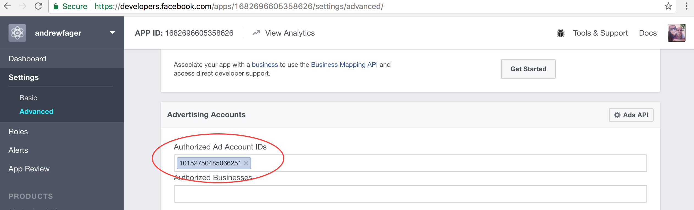

# Getting Started with Facebook Marketing API 
A step-by-step guide to automatically creating Ads in Python with the Facebook Marketing API. In this guide a 'Brand Awareness' Ad is automatically created in the example ``ad_brand_awareness.py`` code

## Install Marketing API SDK for Python
Use pip to install
```
pip install facebookads
```
See <a href="github.com/facebook/facebook-python-ads-sdk">github.com/facebook/facebook-python-ads-sdk</a> for more information

## Account Setup

### Create Advert Account
create account at www.facebook.com/ads/manager

### Create App
create a new app at developers.facebook.com


### Allow API access to the App
API access to our new app needs to be enabled.  
developers.facebook.com
settings > advanced


### Add Advert account to the App

The app and advert account need to linked. Enter Advert account number under app's advanced settings.


### Access Token
Create user access token to the App. One way to do this is in the graph API explorer.
https://developers.facebook.com/tools/explorer

Select correct app


Select 'create user access token'


Make sure permisions are enabled for: 
ads_management, ads_read, read_insights


## Create Ad
Use sample code to create a brand awareness ad. First fill our 'User Input' section at begining of ``ad_awareness.py``
```

### User Input ###

access_token    = '<ACCESS_TOKEN>'
ad_account_id   = '<AD_ACCOUNT_ID>'
page_id         = '<PAGE_ID>'

img_filename    = '/path/to/image.jpg'
link_url        = 'http://www.mylink.com'
link_message    = 'try it out'

campaign_name   = 'My Campaign2'
campaign_status = 'ACTIVE'
campaign_status = 'PAUSED'

adset_name      = 'My Adset'
adset_status    = 'ACTIVE'
adset_status    = 'PAUSED'

ad_name         = 'My Ad'
ad_status       = 'ACTIVE'
ad_status       = 'PAUSED'
```

Run the python file to automatically create an Ad

```
python ad_brand_awareness.py
```

## Resources
<a href="github.com/facebook/facebook-python-ads-sdk">github.com/facebook/facebook-python-ads-sdk</a>

www.facebookmarketingdevelopers.com
