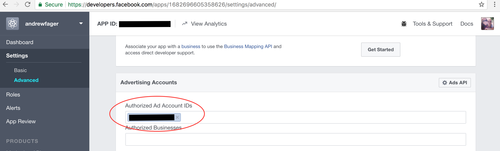

# A Getting Started Guide to the Facebook Marketing API 
A step-by-step guide to automatically creating Ads in Python with the Facebook Marketing API. In this guide a 'Brand Awareness' Ad with ``ad_brand_awareness.py``

## Install Marketing API for Python
Install with pip
```
pip install facebookads
```
See <a href="github.com/facebook/facebook-python-ads-sdk">github.com/facebook/facebook-python-ads-sdk</a> for more information on installation.

## Setup


### App
You will need a Facebook App. Create a new app at https://developers.facebook.com


API access to the app needs to be enabled. This can be done under the App's advanced settings:
settings > advanced


### Ad Account

If not already setup you will need to create an Ad account. This can be done at: https://www.facebook.com/ads/manager/

### Page

The ad needs to reference a Facebook page. If you do not have a page you can create one here: https://www.facebook.com/pages/create

## User Input

Before running ``ad_awareness.py`` fill out the 'User Input' section at the top of ``ad_awareness.py``  

```
### User Input ###

access_token    = '<ACCESS_TOKEN>'
ad_account_id   = '<AD_ACCOUNT_ID>'
page_id         = '<PAGE_ID>'

campaign_name   = 'My Campaign2'
campaign_status = 'ACTIVE'
campaign_status = 'PAUSED'

adset_name      = 'My Adset'
adset_status    = 'ACTIVE'
adset_status    = 'PAUSED'

ad_name         = 'My Ad'
ad_status       = 'ACTIVE'
ad_status       = 'PAUSED'

img_filename    = '/path/to/local/image.jpg'
link_url        = 'http://www.mylink.com'
link_message    = 'try it out'
```

### Access Token
``access_token    = '<ACCESS_TOKEN>'``
Enter access token (as a string). To create one you can use the graph API explorer.
https://developers.facebook.com/tools/explorer

Select app


Select 'create user access token'


Make sure permisions are enabled for: 
``ads_management``, ``ads_read``, ``read_insights``


Once created copy and paste into the ```access_token``` variable.  

### Ad Account ID
``ad_account_id   = '<AD_ACCOUNT_ID>'``
Enter ad account ID (as a string). You can obtain your Ad Account ID from the Ads manager (https://www.facebook.com/ads/manager/).


### Page ID
``page_id         = '<PAGE_ID>'``
You will need to reference your FB page in this ad (again, as a string). You can find your page ID by going to the page's 'About' section. 


### Campaign/Adset/Ad Settings
Assign settings for the campaign/adset/ad. These are things such as naming, targeting, budget, etc. For this example you can keep the defaults for now. Active status is specified using the ```campaign_status```/```adset_status```/```ad_status``` variables. To prevent any charges from being incurred the Campaign/Adset & Ad are all paused when initially created. 


Required Ad Settings
```img_filename``` is a local image file to be uploaded in the API call. 

```link_url``` is a link to your brand's website.

```link_message``` is the text seen when the ad is served.

### Link App & Ad Account
One last step! You will also need to link your app and ad account at https://developers.facebook.com Enter Ad account ID under app's advanced settings.


## Create Ad

use python code automatically create ad
```
python ad_brand_awareness.py
```

Verify ad created successfully by checking that it appears at https://www.facebook.com/ads/manager/


## Resources
<a href="github.com/facebook/facebook-python-ads-sdk">github.com/facebook/facebook-python-ads-sdk</a>

www.facebookmarketingdevelopers.com
